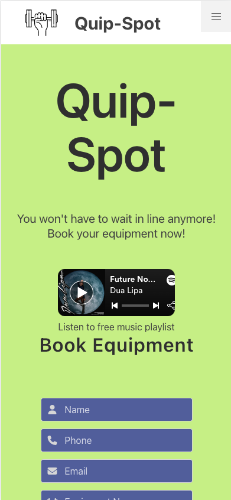
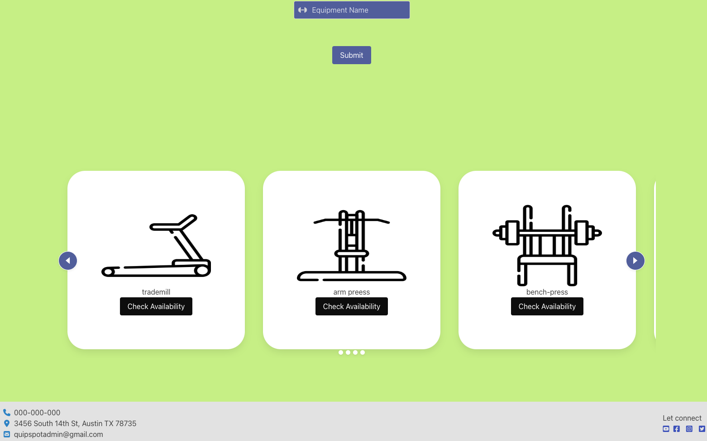

# Quip-Spot

## Table of Contents

- [Description](#Description)
- [Features](#Features)
- [Lessons Learned](# "Lessons Learned")
- [Improvement Opportunities](# "Improvement Opportunities")
- [Usage](#Usage)
- [Credits](#Credits)
- [Badges](#Badges)

## Description

Purpose: During peak time during gym workout, there would be a wait for gym equipment. To avoid the wait, this app is designed to reserve the equipment ahead of time. Therefore, saving your spot and eliminating the frustration of waiting for your turn for the equipment. 

## Features

Capabilties: 
- Listen to Spotify album
- Sign up and submit
- Swipe left and right on carousel to select desired equipment
- Check availability by date and time
- Reserve equipment with date and time
- Links to other pages
- Links to social media

## Lessons Learned

Lessons Learned: 
- Worked as a development team
- Conducted daily scrum
- More proficient with Pushing and Pulling from Github
- Usage of Bulma CSS
- Usage of API
- Reveiwing code and approving it

## Improvement Opportunities

Improvement Opportunities:
- Responsiveness
- Buttons functionality
- More pages
- Implement QR Code functionality 

## Usage

## Credits

Developers:
- [Elle Floyd](#https://github.com/chickengong)
- [Tangnay Ou](#https://github.com/Tangnay) 
- [Ashley Ramirez](#https://github.com/aramirez0) 
- [Jessica Canada](#https://github.com/thejesscanada) 
- [Vinnie Waan](#https://github.com/VinnieWaan) 

Third Party Assets:
- [Font Awesome](#https://kit.fontawesome.com/762078615f.js)
- [Bulma CSS](#https://cdn.jsdelivr.net/npm/bulma@0.9.4/css/bulma.min.css)
- [Bulma Carousel CSS](#https://cdn.jsdelivr.net/npm/bulma-carousel@4.0.3/dist/css/bulma-carousel.min.css)
- [Bulma Carousel JS](#https://cdn.jsdelivr.net/npm/bulma-carousel@4.0.3/dist/js/bulma-carousel.min.js)
- [Google Fonts](#https://fonts.googleapis.com/css?family=Open+Sans&display=swap)
- [jQuery](#https://cdnjs.cloudflare.com/ajax/libs/jquery/3.2.1/jquery.min.js)

## Badges

